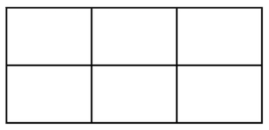
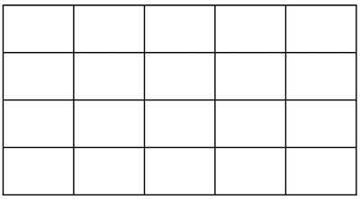
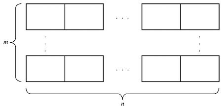

--------------------------------------------------------------------------------------------

## Rectangles Everywhere!

1. Find _all_ of the rectangles are in following diagram. How many are there?

   

2. How many rectangles are in this bigger grid?

   

__Bonus__

3. Can you find a formula for the number of rectangles in a grid formed that is $m$ bricks
   tall and $n$ bricks wide?

   

--------------------------------------------------------------------------------------------

## Resources

* [Hints](6pVn3BbaY2SPB5LzpwF4ko-hints.md)
* [Solutions](6pVn3BbaY2SPB5LzpwF4ko-solutions.md)

--------------------------------------------------------------------------------------------

* _Puzzle ID_: 6pVn3BbaY2SPB5LzpwF4ko
* _Puzzle Version_: 2022-11-02T09:25:49
