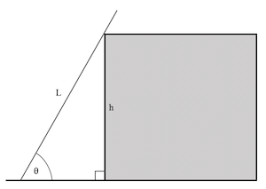
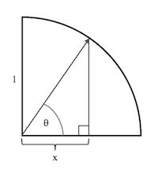

--------------------------------------------------------------------------------------------

## Simpler Inequalities - Polynomials FTW

Inequalities are great for estimating the size of quantities of interest … but only if
they are simple enough.

### The Situation

Suppose we need to estimate the length $L$ of a ladder to buy in order to reach the top
of a building of height $h$ if we want the ladder to make an angle $\theta$ with the
ground.

To help us, we have a device that tells us $x$ when we set the movable arm to the desired
angle.

### How Long Does the Ladder Need to Be?

1. Show that if the ladder just barely reaches the corner of the building, then its length
   is equal to

   $$
   L_{min} = \frac{h}{\sqrt{1 - x^2}}.
   $$

2. For safety reasons, we definitely want to buy a ladder with $L \ge L_{min}$, but we
   don't need to know the exact value of $L_{min}$. It's _good enough_ to calculate an
   estimate that is always bigger than $L_{min}$ … and it's nice if the estimate is
   _easier to calculate_ for those times when we don't have a calculator handy
   (multiplication and addition are less work than square roots and division).

   Show that if $x$ is positive and close to zero (i.e., the ladder is close to vertical),
   we can use simpler formula $(1 + x^2)$ to estimate the shortest ladder to buy. In other
   words, show that

   $$
   \frac{1}{\sqrt{1 - x^2}} \le 1 + x^2.
   $$

### Bonus

3. Like most approximations, inequality in Problem #2 is only true for certain values of
   $x$. For example, when $x$ is close to one, the left-hand side of the inequality is
   very large while the right-hand side approximately equal to $2$.

   Find the largest value of $x$ that the inequality is true for.

--------------------------------------------------------------------------------------------

## Resources

* [Hints](6ry5z6dEs2cuzsFYLzheWR-hints.md)
* [Solutions](6ry5z6dEs2cuzsFYLzheWR-solutions.md)

--------------------------------------------------------------------------------------------

* _Puzzle ID_: 6ry5z6dEs2cuzsFYLzheWR
* _Puzzle Version_: 2022-09-10T14:18:33
