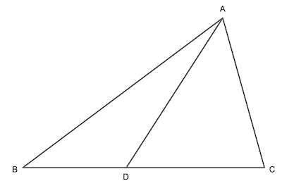

--------------------------------------------------------------------------------------------

## Triangle Inequalities - On the Edge

Let point $D$ lies on side $BC$ of triangle $\triangle ABC$. It is tempting to guess that
the length of $AD$ is the average of the lengths of $AB$ and $AC$. This is wrong, but is
_not that far off_. It turns out that the length of $AD$ is between the average minus half
$BC$ and the average plus half $BC$.

In other words,

$$
\frac{1}{2} (AB + AC) - \frac{1}{2} BC
\le AD
\le \frac{1}{2} (AB + AC) + \frac{1}{2} BC
$$

Why is this true?

[Hints](Z9ziMdEQ58WhEHqFxiQJ9g-hints.md)
[Solutions](Z9ziMdEQ58WhEHqFxiQJ9g-solutions.md)

--------------------------------------------------------------------------------------------

* _Puzzle ID_: Z9ziMdEQ58WhEHqFxiQJ9g
* _Puzzle Version_: 2022-08-30
