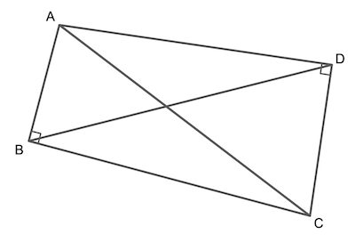

--------------------------------------------------------------------------------------------

## Diagonals of Imperfect Rectangles

Quadrilateral $ABCD$ is an attempt at drawing a rectangle.

We have checked that $\angle ABC$ and $\angle CDA$ are right angles, but something still
looks a little off. It looks like $AC$ is longer than $BD$, and _indeed it is!_

Show that it will always be this way: no matter how badly we draw a rectangle, if one pair
of opposite corners are right angles, then the diagonal between right angles will never be
longer than the diagonal between the other pair of opposite corners.

--------------------------------------------------------------------------------------------

## Resources

* [Hints](bbboYHCZmv82vaSWAdBm7t-hints.md)
* [Solutions](bbboYHCZmv82vaSWAdBm7t-solutions.md)

--------------------------------------------------------------------------------------------

* _Puzzle ID_: bbboYHCZmv82vaSWAdBm7t
* _Puzzle Version_: 2022-09-04
