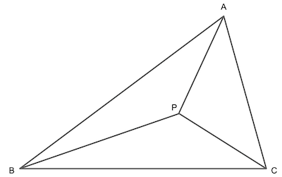

--------------------------------------------------------------------------------------------

## Triangle Inequalities - In the Zone

Suppose that after buying just enough rope to fence off $\triangle ABC$, we decide that we
want to connect the corners of $\triangle ABC$ to a point $P$ inside the triangle.

It turns out that we can estimate how much more rope we need to buy _without_ measuring
$AP$, $BP$, and $CP$. The amount of additional rope we will need to buy is between
half the perimeter and the perimeter. In other words,

$$
\frac{1}{2} (AB + BC + AC)
\le AP + BP + CP
\le AB + BC + AC.
$$

Show why this is true.

[Hints](j8xxXqeFH78pKStzUvwvMD.md)
[Solutions](j8xxXqeFH78pKStzUvwvMD.md)

--------------------------------------------------------------------------------------------

* _Puzzle ID_: j8xxXqeFH78pKStzUvwvMD
* _Puzzle Version_: 2022-08-30
* _Upstream Puzzles_: [[Z9ziMdEQ58WhEHqFxiQJ9g]]
